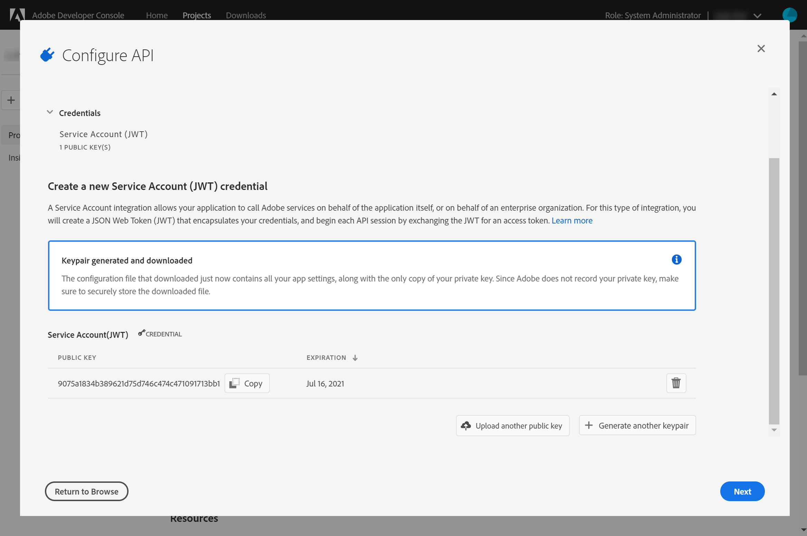
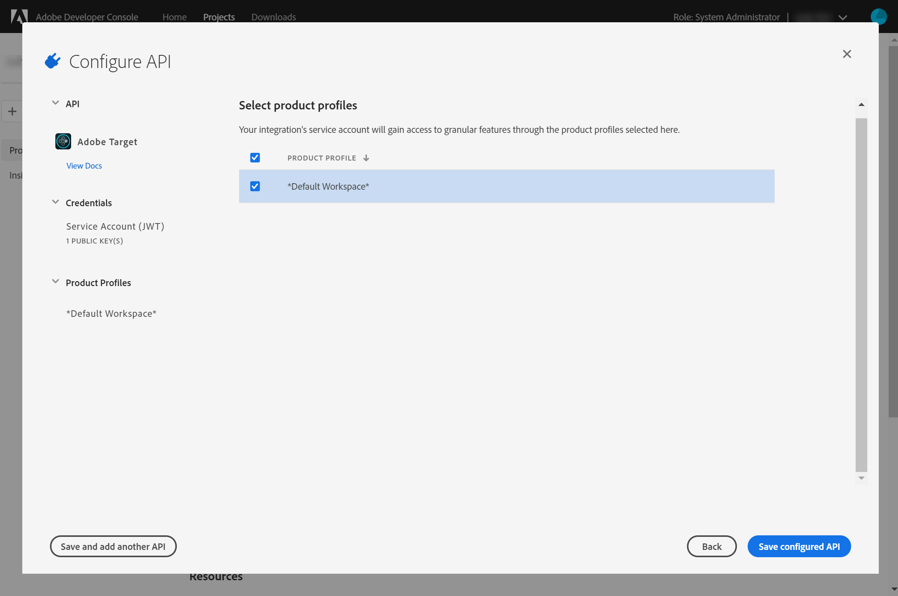
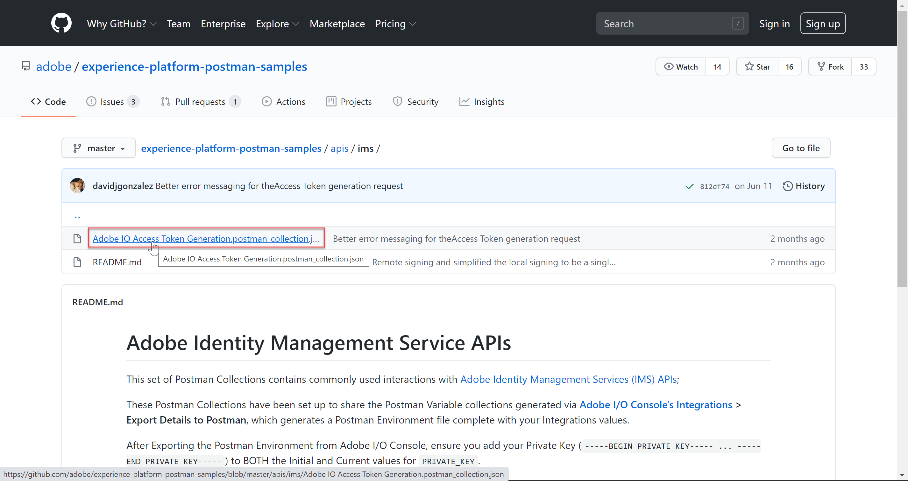

# Verificatie voor Adobe Target API&#39;s configureren

De Adobe Target Admin API&#39;s, inclusief [!DNL Recommendations] Admin API&#39;s, worden beveiligd door verificatie, zodat alleen geautoriseerde gebruikers deze kunnen gebruiken om toegang te krijgen tot Adobe Target. Gebruik de [Adobe Developer Console](https://console.adobe.io/) om deze verificatie voor alle Adobe Experience Cloud-oplossingen te beheren, inclusief [!DNL Target].

In deze les worden de voorafgaande stappen doorlopen die nodig zijn om verificatietokens te genereren die nodig zijn om te kunnen communiceren met Adobe Target API&#39;s. In de volgende secties gaat u:

1. Maak een project (voorheen integratie genoemd) in de Adobe Developer-console.
2. Exporteer projectdetails naar Postman.
3. Genereer een toegangstoken voor toonder.
4. Test het toegangstoken van de drager.

## Voorwaarden

| Resource | Details |
| --- | --- |
| Postman | Als u deze stappen wilt voltooien, [Postman-app](https://www.postman.com/downloads/) voor uw besturingssysteem. Postman basic is gratis bij het maken van accounts. Hoewel Postman niet vereist is voor het gebruik van Adobe Target API&#39;s in het algemeen, maakt het API-workflows eenvoudiger en biedt Adobe Target verschillende Postman-verzamelingen om de API&#39;s van uit te voeren en te leren hoe ze werken. De rest van deze zelfstudie gaat uit van praktische kennis van Postman. Raadpleeg voor hulp de [Postman-documentatie](https://learning.getpostman.com/). |
| Verwijzingen | Gedurende de rest van deze zelfstudie wordt aangenomen dat u bekend bent met de volgende bronnen:<UL><li>[Adobe I/O Github](https://github.com/adobeio)</li><li>[Doeldocumentatie voor Adobe I/O](https://developers.adobetarget.com/api/#introduction)</li><li>[Recommendations API-documentatie](https://developers.adobetarget.com/api/recommendations/)</li></ul> |

## Een Adobe I/O-project maken

In deze sectie opent u de Adobe Developer-console en maakt u een project voor [!DNL Adobe Target]. Raadpleeg voor meer informatie de [documentatie over projecten](https://www.adobe.io/apis/experienceplatform/console/docs.html#!AdobeDocs/adobeio-console/master/projects.md).

<!--1. Generate your private key and public certificate, per the [documentation on authentication](https://www.adobe.io/authentication/auth-methods.html#!AdobeDocs/adobeio-auth/master/JWT/JWTCertificate.md). //<!--as described in **Step 1** of [How to set up Adobe IO: Authentication - Step by Step](https://helpx.adobe.com/marketing-cloud-core/kb/adobe-io-authentication-step-by-step.html). After completing Step 1, return to this tutorial and resume with Step 2, below. // The outcome of this step should be the creation of a `private.key` file and a `certificate_pub.crt` file. Return to this tutorial once you have generated these two files.-->

1. In de [Adobe Admin Console](https://adminconsole.adobe.com/), zorg ervoor dat je Adobe-gebruikersaccount aan beide is toegekend [Productbeheerder](https://helpx.adobe.com/enterprise/using/admin-roles.html) en [Ontwikkelaar](https://helpx.adobe.com/enterprise/using/manage-developers.html) toegang tot [!DNL Target].

2. In de [Adobe Developer Console](https://console.adobe.io/)Selecteer de Experience Cloud-organisatie waarvoor u deze integratie wilt maken. (Let op: u hebt waarschijnlijk slechts toegang tot één Experience Cloud-organisatie.)

   

3. Klik op **[!UICONTROL Create new project]**.

   

4. Klikken **[!UICONTROL Add API]** om een REST-API aan uw project toe te voegen voor toegang tot Adobe-services en -producten.

   

5. Selecteren **[!DNL Adobe Target]** als de Adobe-service waarmee u wilt integreren. Klik op de knop **[!UICONTROL Next]** die wordt weergegeven.

   

6. Selecteer een optie voor het koppelen van openbare en persoonlijke sleutels aan de integratie van de de dienstrekening u voor Doel creeert. Voor deze zelfstudie selecteert u **[!UICONTROL Option 1: Generate a key pair]** en klik op **[!UICONTROL Generate keypair]**.
   

7. Noteer het resultaat! Noteer het automatisch gedownloade configuratiebestand (`config`), dat uw persoonlijke sleutel bevat. Klik op **[!UICONTROL Next]**.
   
8. Controleer in uw bestandssysteem de locatie van `config`Dit is het gecomprimeerde configuratiebestand dat in de vorige stap is gemaakt. Nogmaals, dit `config` bevat uw persoonlijke sleutel, die u later nodig hebt. De exacte locatie in uw bestandssysteem kan afwijken van de locatie die u hier ziet.
   
9. Selecteer in de Adobe Developer-console de optie [productprofiel(en)](https://helpx.adobe.com/enterprise/using/manage-products-and-profiles.html) komt overeen met de eigenschappen waarin u gebruikt [!DNL Recommendations]. (Als u geen eigenschappen gebruikt, selecteert u de optie Standaardwerkruimte.) Klik op **[!UICONTROL Save configured API]**.
   

10. Klik op **[!UICONTROL Create Integration]**. U ontvangt een tijdelijk bericht dat aangeeft dat de API is geconfigureerd.

11. Als laatste stap wijzigt u de naam van het project in een naam die betekenisvoller is dan de naam van het oorspronkelijke project `Project 1`. Om dit te doen, navigeer aan het project gebruikend de navigatiepad zoals getoond, klik **[!UICONTROL Edit project]** toegang tot de[!UICONTROL Edit Project] en wijzig de naam van het project.

>[!NOTE]
> 
>In deze zelfstudie noemen we ons project &#39;Doelintegratie&#39;. Als u uw project voor meer dan enkel Adobe Target wilt gebruiken, kunt u het dienovereenkomstig willen noemen. U kunt bijvoorbeeld de naam &quot;Adobe API&#39;s&quot; of &quot;Experience Cloud API&#39;s&quot; wijzigen, omdat deze API&#39;s kunnen worden gebruikt met andere oplossingen in de Adobe Experience Cloud.

## Projectdetails exporteren

Nu hebt u een Adobe-project dat u kunt gebruiken voor toegang tot [!DNL Target], moet u ervoor zorgen om details van dat project samen met uw Adobe API verzoeken te verzenden. Deze gegevens zijn vereist voor interactie met verschillende Adobe-API&#39;s, waaronder diverse [!DNL Target] API&#39;s. De integratiedetails bevatten bijvoorbeeld autorisatie- en verificatiegegevens die vereist zijn voor de [!DNL Target] Admin API&#39;s. Als u de API&#39;s met Postman wilt gebruiken, moet u deze gegevens daarom naar Postman overbrengen.

Er zijn vele manieren om de details van uw project in Postman te specificeren, maar in deze sectie, profiteren wij van sommige pre-gebouwde eigenschappen en inzamelingen. Eerst (in deze sectie) exporteert u de details van uw integratie naar een Postman-omgeving. Daarna (in de volgende sectie), zult u een dragertoegangstoken produceren om u toegang tot de noodzakelijke middelen van Adobe te verlenen.

>[!NOTE]
>
>Voor video-instructies die van toepassing zijn op elke Experience Cloud-oplossing, inclusief [!DNL Target], zie [Postman gebruiken met Experience Platform-API&#39;s](https://experienceleague.adobe.com/docs/platform-learn/tutorials/platform-api-authentication.html?lang=en). De volgende punten zijn relevant voor de [!DNL Target] API&#39;s:
>
> 1. Adobe I/O Integration Details exporteren naar Postman
> 2. Een toegangstoken genereren met Postman

>
> Deze stappen worden ook hieronder gegeven.

1. Nog steeds in de [Adobe Developer Console](https://console.adobe.io/), navigeert u om de **[!UICONTROL Service Account (JWT)]** referenties. Gebruik de linkernavigatie of de **[!UICONTROL Credentials]** zoals weergegeven.
   
In **[!UICONTROL Credential details]**, let erop dat u uw **Openbare sleutel(s)**, **Client-id**en andere informatie over uw serviceaccount.
   
2. Klik om naar informatie over de **[!UICONTROL Adobe Target]** API. Gebruik de linkernavigatie of de **[!UICONTROL Connected products and services]** zoals weergegeven.
   
3. Klikken **[!UICONTROL Download for Postman]** > **[!UICONTROL Service Account (JWT)]** om een JSON-bestand te maken waarin uw verificatiegegevens worden vastgelegd voor een Postman-omgeving.
   
Noteer het JSON-bestand in uw bestandssysteem.
   
4. Klik in Postman op het tandwielpictogram om uw omgevingen te beheren en klik vervolgens op **Importeren** om het JSON-bestand (omgeving) te importeren.
   
5. Kies uw bestand en klik op **Openen**.
   
6. In de Postman **Omgevingen beheren** Klik op de naam van de nieuwe geïmporteerde omgeving om deze te inspecteren. (De naam van uw omgeving kan verschillen van de naam die u hier ziet. Bewerk de naam naar wens. Dit hoeft niet noodzakelijkerwijs overeen te komen met de naam van het Adobe-project.)
   
7. Opmerking `CLIENT_SECRET` en `API_KEY` (samen met andere variabelen) hun waarden vooraf invullen en uit uw integratie halen zoals gedefinieerd in de Adobe Developer-console. (De Postman `CLIENT_SECRET` variabele moet overeenkomen met `CLIENT SECRET` Adobe-referentie zoals weergegeven in de Developer Console, en `API_KEY` in Postman `CLIENT ID` in de Developer Console.) Notitie daarentegen `PRIVATE_KEY`, `JWT_TOKEN`, en `ACCESS_TOKEN` zijn leeg. Laten we beginnen met de `PRIVATE_KEY` waarde.
   

   >[!NOTE]
   >
   >**Verrassend!**
   >
   >Pop-quiz! Kunt u zich herinneren waar uw persoonlijke sleutel is?
   >Dat klopt, het zit in de `config` bestand dat eerder is gedownload van de Adobe Developer Console!

8. Open uw `config` en opent u het `private` sleutelbestand.
   
9. Selecteer en kopieer de volledige inhoud van het dialoogvenster `private` sleutelbestand.
   
10. Plak in Postman uw waarde voor de persoonlijke sleutel in de **EERSTE WAARDE** en **HUIDIGE WAARDE** velden.
   
11. Klikken **[!UICONTROL Update]** en sluit het modaal milieu.

## Het toegangstoken voor toonder genereren

In deze sectie genereert u uw toegangstoken aan toonder, die nodig is voor het verifiëren van uw interactie met Adobe Target API&#39;s. Als u uw toegangstoken voor toonder wilt genereren, moet u uw integratiegegevens (die in de voorgaande secties zijn vastgelegd) naar de [Adobe Identity Management Service (IMS)](https://www.adobe.io/authentication/auth-methods.html#!AdobeDocs/adobeio-auth/master/AuthenticationOverview/AuthenticationGuide.md). Er zijn een paar verschillende manieren om dit te doen, maar in deze zelfstudie kunt u een verzoek voor een POST op maat maken voor de IMS API. Grapje. In deze zelfstudie maken we gebruik van een Postman-verzameling die een vooraf gebouwde IMS-aanroep bevat die het proces direct en eenvoudig maakt. Nadat u de verzameling hebt geïmporteerd, kunt u deze desgewenst opnieuw gebruiken om nieuwe tokens te genereren, niet alleen voor Adobe Target, maar ook voor andere Adobe-API&#39;s.

1. Ga naar de [Adobe Identity Management Service API voorbeeldaanroepen](https://github.com/adobe/experience-platform-postman-samples/tree/master/apis/ims).
   
2. Klik op de knop **Adobe I/O Access Token Generation Postman-verzameling**.
   
3. Haal de onbewerkte JSON voor deze verzameling op door op **Ruw**en kopieert u de resulterende JSON naar het klembord. (U kunt de onbewerkte JSON ook opslaan als een .json-bestand.)
   
4. Importeer de verzameling in Postman door de onbewerkte JSON vanaf het Klembord te plakken en in te dienen. (U kunt ook het .json-bestand uploaden dat u hebt opgeslagen.) Klikken **Doorgaan**.
   
5. Selecteer **[!UICONTROL IMS: JWT Generate + Auth via User Token]** verzoek in de inzameling van Postman van de Generatie van de Token van de Toegang van de Adobe I/O, zorg ervoor uw milieu wordt geselecteerd en klik **Verzenden** om het token te genereren.

   

   >[!NOTE]
   >
   >Dit toegangsteken aan toonder is 24 uur geldig. Verzend het verzoek opnieuw wanneer u een nieuw teken moet produceren.

6. Open nogmaals het modaal van Milieu&#39;s beheren en selecteer uw milieu.
   
7. Noteer de `ACCESS_TOKEN` en `JWT_TOKEN` waarden worden nu gevuld.
   

>[!NOTE]
>
>V: Moet ik de inzameling van Postman van de Generatie van de Token van de Toegang van de Adobe I/O gebruiken om de Token van het Web JSON (JWT) en het toegangstoken van de tokentoken van de drager te produceren?
>
>A: Nee! De inzameling van Postman van de Generatie van de Token van de Toegang van de Adobe I/O is beschikbaar als gemak om JWT en het toegangstoken van de tokens in Postman gemakkelijker te produceren. U kunt ook de mogelijkheden in de Adobe Developer-console gebruiken om het toegangstoken voor toonder handmatig te genereren.

## Test het toegangstoken aan toonder

In deze oefening, zult u uw nieuwe toegangsteken van de toverdrager gebruiken door een API verzoek te verzenden dat een lijst van activiteiten van uw terugwint [!DNL Target] account. Een geslaagde reactie geeft aan dat uw Adobe-project en -verificatie naar behoren werken om de API te kunnen gebruiken.

1. Het dialoogvenster Importeren [Adobe Target Admin API&#39;s Postman Collection](https://developers.adobetarget.com/api/#admin-postman-collection). Volg alle aanwijzingen totdat de verzameling in Postman is geïmporteerd.
   
1. Vouw de verzameling uit en noteer de **[!UICONTROL List activities]** verzoek.
   
1. Variabelen zoals `{{access_token}}` zijn aanvankelijk niet opgelost. U kunt dit probleem op verschillende manieren oplossen. U kunt bijvoorbeeld een nieuwe verzamelingsvariabele definiëren met de naam `{{access_token}}`—maar in deze zelfstudie wijzigt u in plaats daarvan de API-aanvraag om de Postman-omgeving die u eerder gebruikte te benutten. Hierdoor kan de omgeving blijven fungeren als één consistente consolidatie van alle variabelen die op Adobe-API&#39;s voorkomen.
   
1. Te vervangen tekst `{{access_token}}` with `{{ACCESS_TOKEN}}`.
   
1. Te vervangen tekst `{{api_key}}` with `{{API_KEY}}`.
   
1. Te vervangen tekst `{{tenant}}` with `{{TENANT_ID}}`. Opmerking `{{TENANT_ID}}` wordt nog niet herkend.
   
1. Open het modaal beheer van milieu&#39;s, en selecteer uw milieu.
   
1. Typ om een nieuwe `{{TENANT_ID}}` omgevingsvariabele. Kopieer en plak uw waarde voor de id van de huurder in de **EERSTE WAARDE** en **HUIDIGE WAARDE** velden voor uw nieuwe `TENANT_ID` omgevingsvariabele.

   

   >[!NOTE]
   >
   >De Tenant ID is anders dan uw [!DNL Target] `clientcode`. De huurder-id staat in de URL wanneer u bent aangemeld bij [!DNL Target]. Meld u aan bij de [!DNL Adobe Experience Cloud], open [!DNL Target]en klik op de knop [!DNL Target] kaart. Gebruik de waarde van de huurder-id zoals vermeld in het URL-subdomein.
   >
   >Stel bijvoorbeeld dat uw URL bij aanmelding bij Adobe Target
   >
   >`<https://mycompany.experiencecloud.adobe.com/...>`
   >
   >Dan is je Tenant ID &quot;mijnbedrijf&quot;.

1. Verzend uw verzoek nadat u de juiste omgeving hebt geselecteerd. U ontvangt een reactie met uw lijst met activiteiten.
   

Gefeliciteerd! Nu u uw Adobe-verificatie hebt geverifieerd, kunt u deze gebruiken om te communiceren met Adobe Target API&#39;s (en andere Adobe API&#39;s). U kunt bijvoorbeeld [Recommendations API&#39;s gebruiken](https://experienceleague.adobe.com/docs/target-learn/recommendations-api-tutorial/recs-api-overview.html) om aanbevelingen te creëren of te beheren.
