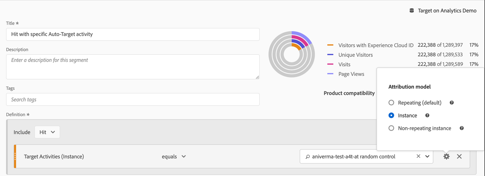
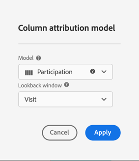
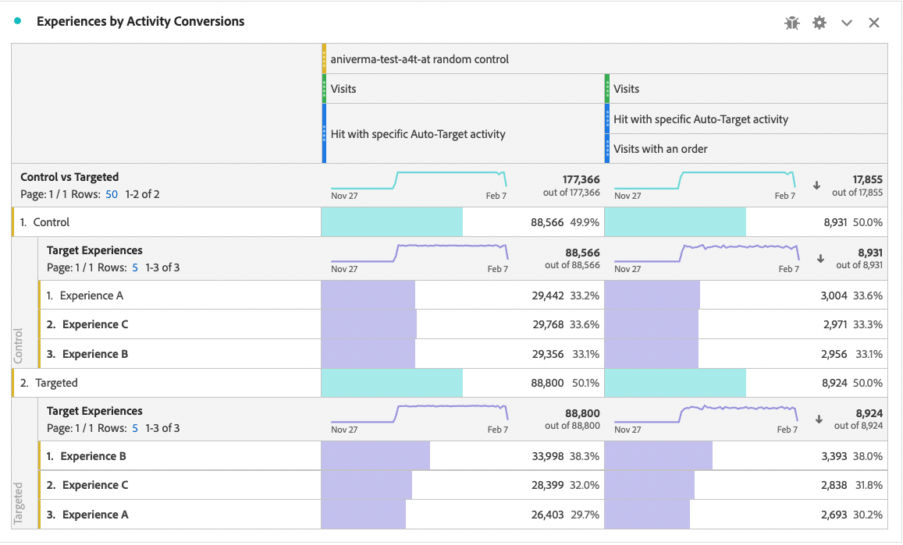

# A4T-rapporten instellen in Analysis Workspace voor [!DNL Auto-Target]-activiteiten

Bij de integratie Analytics for Target (A4T) voor [!DNL Auto-Target]-activiteiten wordt gebruikgemaakt van algoritmen voor het leren van ensemble Machine Learning (ML) van Adobe Target om de beste ervaring te kiezen voor elke bezoeker op basis van zijn profiel, gedrag en context, terwijl een Adobe Analytics-doelstelling wordt gebruikt.

Hoewel uitgebreide analysemogelijkheden beschikbaar zijn in Adobe Analytics Analysis Workspace, zijn enkele wijzigingen in het standaard **[!UICONTROL Analytics for Target]**-deelvenster vereist om [!DNL Auto-Target]-activiteiten correct te interpreteren, vanwege verschillen tussen experimentatieactiviteiten (handleiding A/B en automatisch toewijzen) en personalisatieactiviteiten ([!DNL Auto-Target]).

Deze zelfstudie doorloopt de aanbevolen wijzigingen voor het analyseren van [!DNL Auto-Target]-activiteiten in Workspace, die gebaseerd zijn op de volgende sleutelconcepten:

* De **[!UICONTROL Control vs Targeted]** dimensie kan worden gebruikt om tussen de ervaringen van de Controle tegenover die te onderscheiden die door [!DNL Auto-Target] worden gediend ensemble ML algoritme.
* Bezoekingen moeten worden gebruikt als de normaliserende maatstaf bij het bekijken van baanbrekingen van prestaties op ervaringsniveau. Daarnaast kan de standaardmethode voor tellen van [Adobe Analytics bezoeken omvatten waarbij de gebruiker de activiteitsinhoud niet echt ziet](https://experienceleague.adobe.com/docs/target/using/integrate/a4t/a4t-faq/a4t-faq-viewing-reports.html?lang=en#metrics), maar dit standaardgedrag kan worden gewijzigd door een geschikt bereiksegment te gebruiken (details hieronder).
* Visit-lookback scoped attributie-ook gekend als &quot;bezoek lookback venster&quot;op het voorgeschreven attributiemodel-wordt gebruikt door de modellen van XML van Adobe Target tijdens hun opleidingsfasen, en het zelfde (niet gebrek) attributiemodel zou moeten worden gebruikt wanneer het breken van doel metrisch.

## Een A4T maken voor het [!DNL Auto-Target]-deelvenster in Workspace

Om een A4T voor [!DNL Auto-Target] rapport tot stand te brengen, of begin met **[!UICONTROL Analytics for Target]** paneel in Werkruimte, zoals hieronder getoond, of met een vrije vormlijst. Maak vervolgens de volgende selecties:

1. **[!UICONTROL Control Experience]**: U kunt elke ervaring kiezen; u zult deze keuze later echter overschrijven. Merk op dat voor [!DNL Auto-Target] activiteiten, de controleervaring echt een controlestrategie is, die of a) willekeurig onder alle ervaringen dient, of b) één enkele ervaring dient (deze keus wordt gemaakt op het tijdstip van de activiteitenverwezenlijking in Adobe Target). Zelfs als u voor keus (b)-uw [!DNL Auto-Target] activiteit aangewezen een specifieke ervaring als controle-u zou nog de benadering moeten volgen die in deze zelfstudie voor het analyseren van A4T voor [!DNL Auto-Target] activiteiten wordt geschetst.
2. **[!UICONTROL Normalizing Metric]**: Selecteer Bezoeken.
3. **[!UICONTROL Success Metrics]**: Hoewel u om het even welke metrisch(e) kunt selecteren waarop om te melden, zou u rapporten over het algemeen over zelfde metrisch moeten bekijken die voor optimalisering tijdens activiteitenverwezenlijking in Adobe Target werd gekozen.

*pngFiguur 1: Analyse voor instellen van het deelvenster Doel voor  [!DNL Auto-Target] activiteiten.*

>[!NOTE]
>
>Om uw Analytics voor het paneel van het Doel voor activiteiten te plaatsen Auto-Target, verkies om het even welke controleervaring, kies Bezoeken als normaliserend metrisch, en kies het zelfde doel metrisch dat voor optimalisering tijdens de verwezenlijking van de activiteit van het Doel werd gekozen.

## Gebruik de besturingselementen versus de doeldimensie om het samenstellende XML-model van Adobe Target te vergelijken met uw besturingselement

Het standaard A4T-deelvenster is ontworpen voor klassieke (handmatige) A/B-tests of Auto-Allocate-activiteiten, waarbij het doel is de prestaties van individuele ervaringen te vergelijken met de ervaring in het beheer. Bij activiteiten [!DNL Auto-Target] moet de eerste orde vergelijking tussen de Controle *strategy* en de Gerichte *strategy* (met andere woorden, het bepalen van de lift van de algemene prestaties van het [!DNL Auto-Target] model van SPL over de strategie van de Controle) zijn.

Voor deze vergelijking gebruikt u de **[!UICONTROL Control vs Targeted (Analytics for Target)]**-dimensie. Sleep en zet neer om de **[!UICONTROL Target Experiences]** dimensie in het standaardA4T rapport te vervangen.

Deze vervanging maakt de standaardberekeningen voor het optillen en vertrouwen in het deelvenster A4T ongeldig. Om verwarring te voorkomen, kunt u deze metriek uit het standaardpaneel verwijderen, verlatend het volgende rapport:

*pngFigure 2: Het aanbevolen basisrapport voor  [!DNL Auto-Target] activiteiten. Dit rapport is gevormd om gericht verkeer (gediend door het ensemble model van ML) tegen uw verkeer van de Controle te vergelijken.*

>[!NOTE]
>
>De aantallen van de Optillen en van het Vertrouwen zijn momenteel niet beschikbaar voor Controle vs gerichte dimensies voor A4T rapporten voor auto-Doel. Totdat ondersteuning is toegevoegd, kunnen Lift en Trust handmatig worden berekend door de [betrouwbaarheidscalculator](https://experienceleague.adobe.com/docs/target/assets/complete_confidence_calculator.xlsx?lang=en) te downloaden.

## Uitsplitsingen op ervaringsniveau toevoegen

Om meer inzicht in te krijgen hoe het ensemble ML model presteert, kunt u ervaring-vlakke onderverdelingen van de **[!UICONTROL Control vs Targeted]** dimensie onderzoeken. In Werkruimte, sleep de **[!UICONTROL Target Experiences]** dimensie op uw rapport, dan onderverdeeld onderaan elk van de Controle en de gerichte afmetingen afzonderlijk.

*pngFigure 3: Verdeling van de gerichte dimensie door de Ervaringen van het Doel*

Hier wordt een voorbeeld van het resulterende rapport weergegeven.

*pngFiguur 4: Een standaard  [!DNL Auto-Target] rapport met de onderverdelingen op ervaringsniveau. Merk op uw doel metrisch kan verschillend zijn, en uw strategie van de Controle kan één enkele ervaring hebben.*

>[!TIP]
>
>Klik in Workspace op het tandwielpictogram om de percentages in de kolom Conversiesnelheid te verbergen, zodat de focus op de conversiesnelheden blijft. De conversiekoersen worden vervolgens opgemaakt als decimalen, maar worden dienovereenkomstig als percentages geïnterpreteerd.

## Waarom &quot;Bezoekingen&quot; de juiste normalisatiemethode is voor [!DNL Auto-Target]-activiteiten

Wanneer het analyseren van een [!DNL Auto-Target] activiteit, kies altijd Bebezoeken als gebrek normaliserend metrisch. [!DNL Auto-Target] voor personalisatie wordt een ervaring gekozen voor een bezoeker die een keer per bezoek een bezoek aflegt (formeel, eenmaal per Adobe Target-sessie). Dit betekent dat de ervaring die een gebruiker wordt getoond, tijdens elk bezoek kan veranderen. Dus als u Unieke bezoekers gebruikt als de normaliserende metrisch, zou het feit dat één enkele gebruiker veelvoudige ervaringen (over verschillende bezoeken) kan uiteindelijk zien tot verwarrende omzettingspercentages leiden.

Dit wordt in een eenvoudig voorbeeld geïllustreerd: een scenario overwegen waarin twee bezoekers een campagne starten die slechts twee ervaringen heeft. De eerste bezoeker bezoekt tweemaal. Zij worden toegewezen aan Experience A tijdens het eerste bezoek, maar beleven B tijdens het tweede bezoek (vanwege hun profielstatus die veranderde bij dat tweede bezoek). Na het tweede bezoek converteert de bezoeker een bestelling. De conversie wordt toegeschreven aan de ervaring die het laatst is opgedaan (Experience B). De tweede bezoeker bezoekt ook twee keer, en wordt Ervaring B getoond beide keer, maar nooit omzet.

Laten we de bezoekers vergelijken met de bezoekers:

| Ervaring | Unieke bezoekers | Bezoeken | Conversies | Norm van bezoeker. Conv. Snelheid | Bezoek norm. Conv. Snelheid |
| --- | --- | --- | --- | --- | --- |
| A | 3 | 3 | - | 0% | 0% |
| B | 2 | 3 | 3 | 50% | 33,3% |
| Totalen | 2 | 4 | 1 | 50% | 25% |
*Tabel 1: Voorbeeld waarin bezoekers-genormaliseerde en bezoek-genormaliseerde rapporten voor een scenario worden vergeleken waarin de besluiten aan een bezoek kleven (en niet bezoeker, zoals met regelmatige tests A/B). De bezoeker-genormaliseerde metriek zijn verwarrend in dit scenario.*

Zoals uit de tabel blijkt, is er een duidelijke incongruentie van bezoekersaantallen. Ondanks het feit dat er in totaal twee unieke bezoekers zijn, is dit geen som van afzonderlijke unieke bezoekers voor elke ervaring. Hoewel de conversiekoers op bezoekersniveau niet noodzakelijkerwijs verkeerd is, hebben conversiekoersen op bezoekniveau veel meer zin als men individuele ervaringen vergelijkt. Formeel is de eenheid van analyse (&quot;bezoeken&quot;) dezelfde als de eenheid van beslissingswaanzin, wat betekent dat uitsplitsingen van meetgegevens op ervaringsniveau kunnen worden toegevoegd en vergeleken.

## Filter voor feitelijke bezoeken aan de activiteit

De standaardtelmethode van Adobe Analytics voor bezoeken aan een doelactiviteit kan bezoeken omvatten waarbij de gebruiker niet met de doelactiviteit heeft gewerkt. Dit is toe te schrijven aan de manier waarop de de activiteitstoewijzingen van het Doel in de de bezoekerscontext van de Analyse worden voortgeduurd. Als gevolg daarvan kan het aantal bezoeken aan de doelactiviteit soms worden opgevoerd, wat leidt tot een verlaging van de omrekeningskoersen.

Als u liever een melding wilt maken van bezoeken waarbij de gebruiker daadwerkelijk heeft gereageerd op de activiteit Auto-Target (door toegang tot de activiteit, een display/visit-gebeurtenis of een conversie), kunt u:

1. Maak een specifiek segment met resultaten van de betreffende doelactiviteit en
1. Filter de metrische bezoekers die dit segment gebruiken.

**Het segment maken:**

1. Selecteer de optie **[!UICONTROL Components > Create Segment]** op de werkruimtewerkbalk.
2. Voer een **[!UICONTROL Title]** voor het segment in. In het onderstaande voorbeeld krijgt het segment de naam [!DNL "Hit with specific Auto-Target activity"].
3. Sleep de **[!UICONTROL Target Activities]** dimensie aan het segment **[!UICONTROL Definition]** sectie.
4. Gebruik de operator **[!UICONTROL equals]**.
5. Zoek naar uw specifieke activiteit van het Doel.
6. Selecteer het tandwielpictogram en selecteer **[!UICONTROL Attribution model > Instance]** zoals weergegeven in de onderstaande afbeelding.
7. Klik op **[!UICONTROL Save]**.

*pngFiguur 5: Gebruik een segment zoals hier getoond om metrisch Visits in uw A4T voor  [!DNL Auto-Target] rapport te filtreren*

Zodra het segment is gecreeerd, gebruik het om metrisch van Bebezoeken te filtreren, zodat omvat metrische bezoeken slechts bezoeken waar de gebruiker met de activiteit van het Doel interactie optrad.

**Bezoeken filteren met dit segment:**

1. Sleep het nieuwe segment van de componententoolbar, en houd over de basis van het **[!UICONTROL Visits]** metrische etiket tot een blauwe **[!UICONTROL Filter by]** herinnering verschijnt.
2. Laat het segment los. Het filter wordt op die metrische waarde toegepast.

Het uiteindelijke deelvenster wordt als volgt weergegeven.

*pngFiguur 6: Rapporteer het paneel met het segment Activiteit voor automatische doelactiviteit toegepast op de  [!UICONTROL Visits] metrische waarde. Dit verzekert slechts bezoeken waar een gebruiker daadwerkelijk met de betrokken activiteit van het Doel in interactie kwam in het rapport wordt opgenomen.*

## Lijn de attributie tussen het modelopleiding van ML en doel metrische generatie uit

Dankzij de integratie van A4T kan het XML-model van [!DNL Auto-Target] *getraind* zijn met dezelfde conversiegebeurtenisgegevens die Adobe Analytics gebruikt om prestatierapporten te genereren *.* Er zijn echter bepaalde veronderstellingen die moeten worden gebruikt bij de interpretatie van deze gegevens bij de opleiding van de modellen van het XML-systeem, die verschillen van de standaardveronderstellingen die tijdens de rapportagefase in Adobe Analytics zijn gemaakt.

In het bijzonder gebruiken de modellen van XML van Adobe Target een bezoek-scoped attributiemodel. Met andere woorden, zij gaan ervan uit dat een conversie moet plaatsvinden tijdens hetzelfde bezoek als een weergave van inhoud voor de activiteit, zodat de conversie &quot;toegeschreven&quot; kan worden aan het besluit van het ML-model. Dit is nodig om te garanderen dat Target zijn modellen tijdig kan opleiden; Het doel kan niet tot 30 dagen wachten op een conversie (het standaardtoewijzingsvenster voor rapporten in Adobe Analytics), alvorens het in de trainingsgegevens voor zijn modellen op te nemen.

Het verschil tussen de door de modellen van Target (tijdens de training) gebruikte attributie en de standaardattributie die wordt gebruikt bij het opvragen van gegevens (tijdens het genereren van rapporten) kan dus tot discrepanties leiden. Het kan zelfs lijken dat de modellen van het ML slecht presteren, terwijl de kwestie eigenlijk bij attributie ligt.

>[!TIP]
>
>Als de modellen van ML voor metrisch optimaliseren die verschillend van dat van de metriek wordt toegeschreven u in een rapport bekijkt, kunnen de modellen niet zoals verwacht presteren! Om dit te vermijden, verzeker de doelmetriek op uw rapport de zelfde die attributie gebruikt door de modellen van XML van Doel wordt gebruikt.

Ga als volgt te werk om doelmetriek weer te geven met dezelfde toewijzingsmethode die door Adobe Target ML-modellen wordt gebruikt:

1. Houd de muisaanwijzer boven het tandwielpictogram van de gewenste meting:
   
1. Ga in het resulterende menu naar **[!UICONTROL Data settings]**.
1. Selecteer **[!UICONTROL Use non-default  attribution model]** (indien nog niet geselecteerd):
   
1. Klik op **[!UICONTROL Edit]**.
1. Selecteer **[!UICONTROL Model]**: **[!UICONTROL Participation]** en **[!UICONTROL Lookback window]**: **[!UICONTROL Visit]**.
   
1. Klik op **[!UICONTROL Apply]**.

Deze stappen verzekeren uw rapport het doel metrisch aan de vertoning van de ervaring zal toeschrijven, als de doel metrische gebeurtenis *om het even welke tijd* (&quot;participatie&quot;) in het zelfde bezoek dat een ervaring werd getoond gebeurde.

## Laatste stap: Een conversiesnelheid maken waarmee de bovenstaande magie wordt vastgelegd

Met de wijzigingen in het Bezoek en de doelmetriek in voorafgaande secties, zou de definitieve wijziging u aan uw gebrek A4T voor [!DNL Auto-Target] rapporterend paneel moeten maken omzettingspercentages tot stand brengen die de correcte verhouding-dat van doel metrisch met de juiste attributie, aan correct gefiltreerde metrische &quot;Bezoekingen&quot;zijn.

Doe dit door een Berekende Metrisch te creëren gebruikend de volgende stappen:

1. Selecteer de optie **[!UICONTROL Components > Create Metric]** op de werkruimtewerkbalk.
1. Voer een **[!UICONTROL Title]** in voor de metrische waarde. Bijvoorbeeld &quot;Bezoek-gecorrigeerde Omzetsnelheid voor Activiteit XXX.&quot;
1. Selecteer **[!UICONTROL Format]** = Percentage en **[!UICONTROL Decimal Places]** = 2.
1. Sleep het relevante doel metrische voor uw activiteit (bijvoorbeeld, de Omzettingen van de Activiteit) in de definitie, en gebruik het tandwielpictogram op dit doel metrisch om het attributiemodel aan (Deelname aan te passen|Bezoek), zoals eerder beschreven.
1. Selecteer **[!UICONTROL Add > Container]** van het hogere recht van **[!UICONTROL Definition]** sectie.
1. Selecteer de operator voor delen (&#39;&#39;) tussen de twee containers.
1. Sleep het eerder gemaakte segment met de naam &quot;Actief met specifieke [!DNL Auto-Target]-activiteit&quot; in deze zelfstudie voor deze specifieke [!DNL Auto-Target]-activiteit.
1. Sleep de metrisch **[!UICONTROL Visits]** in de segmentcontainer.
1. Klik op **[!UICONTROL Save]**.

De volledige berekende metrische definitie wordt hier getoond.

*pngFigure 7: De voor bezoeken en attributie gecorrigeerde definitie van de omrekeningskoers van het model. (Merk op dit metrisch is afhankelijk van uw doel metrisch en activiteit. Met andere woorden, deze metrische definitie is niet herbruikbaar over activiteiten.)*

>[!IMPORTANT]
>
>De omzettingssnelheid-metrische waarde uit het deelvenster A4T is niet gekoppeld aan de omzettingsgebeurtenis of de normaliserende metrische waarde in de tabel. Wanneer u de wijzigingen aanbrengt die in deze zelfstudie worden voorgesteld, wordt de conversiesnelheid niet automatisch aangepast aan de wijzigingen. Daarom als u de wijziging aan één (of allebei) de conversiegebeurtenisattributie en normaliserend metrisch maakt, dan moet u als definitieve stap herinneren om de Conversiesnelheid, zoals hierboven getoond ook te wijzigen.

## Overzicht: Uiteindelijke voorbeeldwerkruimtevenster voor [!DNL Auto-Target]-rapporten

Als u alle bovenstaande stappen in één venster verenigt, wordt in de onderstaande afbeelding een volledige weergave getoond van het aanbevolen rapport voor [!DNL Auto-Target] A4T-activiteiten. Dit rapport is het zelfde als dat gebruikt door de machine het leren modellen van Target om uw doel metrisch te optimaliseren, en het neemt alle nuances en aanbevelingen op die in dit leerprogramma worden besproken. Dit verslag sluit ook het dichtst aan bij de telmethoden die worden gebruikt in traditionele Target-rapporteringsactiviteiten die [!DNL Auto-Target] worden aangestuurd.

*pngFiguur 8: Het laatste A4T- [!DNL Auto-Target] rapport in Adobe Analytics Workspace, waarin alle aanpassingen in metrische definities zijn gecombineerd die in de vorige secties van dit document zijn beschreven.*
