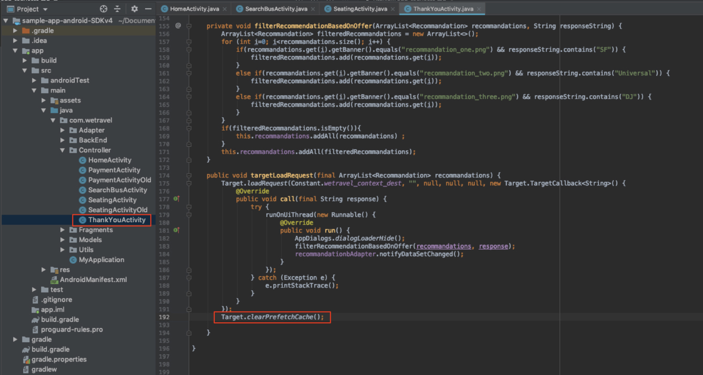

# Adobe Target-verzoeken toevoegen

De Adobe Mobile Services SDK (v4) biedt Adobe Target-methoden en -functionaliteit waarmee u uw app kunt aanpassen met verschillende ervaringen voor verschillende gebruikers. Doorgaans worden een of meer verzoeken vanuit de app naar de Adobe Target gedaan om de gepersonaliseerde inhoud op te halen en het effect van die inhoud te meten.

In deze les bereidt u de Web.Travel-app voor op personalisatie door [!DNL Target] -verzoeken te implementeren.

## Vereisten

Ben zeker aan [ download en werk steekproef app ](download-and-update-the-sample-app.md) bij.

## Leerdoelen

Aan het eind van deze les, zult u kunnen:

* Plaats meerdere [!DNL Target] aanbiedingen (d.w.z. gepersonaliseerde inhoud) in de cache met behulp van een aanvraag voor een batchvoorvertoning
* Vooraf ingestelde [!DNL Target] locaties laden
* Een [!DNL Target] -locatie in realtime laden (niet vooraf ingesteld)
* Vooraf ingestelde locaties uit cache wissen
* Valideer vooraf ingestelde en real-time verzoeken

## Terminologie

Hieronder vindt u een aantal belangrijke doelterminologie die we in de rest van deze zelfstudie zullen gebruiken.

* **Verzoek:** een netwerkverzoek aan de servers van Adobe Target
* **Aanbieding:** een fragment van code of andere op tekst-gebaseerde inhoud, die in het [!DNL Target] gebruikersinterface (of met API) wordt bepaald, die in de reactie wordt geleverd. Doorgaans JSON wanneer [!DNL Target] wordt gebruikt in systeemeigen mobiele apps.
* **Plaats:** een user-defined naam die aan een verzoek wordt gegeven, in de [!DNL Target] interface wordt gebruikt om aanbiedingen met specifieke verzoeken te associëren
* **Verzoek van de Partij:** één enkel verzoek dat veelvoudige plaatsen omvat
* **Prefetch Verzoek:** één enkel verzoek dat aanbiedingen terugwint en hen in geheugen voor toekomstig gebruik in app in cache plaatst
* **Verzoek van de Prefetch van de Partij:** één enkel verzoek dat aanbiedingen voor veelvoudige plaatsen vooraf instelt
* **Publiek:** een groep bezoekers die in de [!DNL Target] interface worden bepaald of aan [!DNL Target] van andere toepassingen van Adobe worden gedeeld (b.v. &quot;bezoekers iPhone X&quot;, &quot;bezoekers in Californië&quot;, &quot;Eerste Open App&quot;)
* **Activiteit:** a [!DNL Target] constructie, die in het [!DNL Target] gebruikersinterface (of met API) wordt bepaald die plaatsen, aanbiedingen en Soorten van het publiek verbindt om een gepersonaliseerde ervaring tot stand te brengen

## Een aanvraag voor een batchvoorvertoning toevoegen

Het eerste verzoek dat we in We.Travel implementeren, is een batchvoorkeursaanvraag met twee [!DNL Target] -locaties op het Basisscherm. In een recentere les, zullen wij aanbiedingen voor deze plaatsen vormen die berichten tonen helpen nieuwe gebruikers door het boekingsproces begeleiden.

Met een Prefetch-aanvraag wordt [!DNL Target] -inhoud zo min mogelijk opgehaald door de Adobe Target-serverreactie (aanbieding) in cache te plaatsen. Een batch-prefetch-aanvraag haalt meerdere aanbiedingen op en plaatst deze in het cachegeheugen, elk gekoppeld aan een andere locatie. Alle vooraf ingestelde locaties worden in het cachegeheugen opgeslagen op het apparaat voor toekomstig gebruik in de gebruikerssessie. Door meerdere locaties vooraf in te stellen op het Homescherm, kunnen we aanbiedingen ophalen die later kunnen worden gebruikt wanneer de bezoeker door de app navigeert. Verwijs naar de [ prefetch documentatie ](https://experienceleague.adobe.com/docs/mobile-services/android/target-android/c-mob-target-prefetch-android.html?lang=nl-NL) voor meer details op prefetch methodes.

### De aanvraag Batch Prefetch toevoegen

Werk de HomeActivity-controller (de broncode van het Homescherm) bij. Deze bevindt zich onder app > main > java > com.wetravel > Controller. De twee in rood weergegeven codeblokken worden toegevoegd:

We beginnen met de HomeActivity-controller (de broncode van het Homescherm), die zich bevindt onder app > main > java > com.wetravel > Controller.

De twee in rood weergegeven codeblokken worden toegevoegd:


De rol neer aan het eind van de code van HomeActivity en voegt hieronder verstrekte code na de `setHeader()` functie toe en *die* de huidige `onResume()` functie vervangt:

```java
@Override
protected void onResume() {
    super.onResume();
    targetPrefetchContent();
}

public void targetPrefetchContent() {
    List<TargetPrefetchObject> prefetchList = new ArrayList<>();
    prefetchList.add(Target.createTargetPrefetchObject(Constant.wetravel_engage_home, null));
    prefetchList.add(Target.createTargetPrefetchObject(Constant.wetravel_engage_search, null));
    Target.TargetCallback<Boolean> prefetchStatusCallback = new Target.TargetCallback<Boolean>() {
        @Override
        public void call(final Boolean status) {
            HomeActivity.this.runOnUiThread(new Runnable() {
                @Override
                public void run() {
                    String cachingStatus = status ? "YES" : "NO";
                    System.out.println("Received Response from prefetch : " + cachingStatus);
                    setUp();

                }
            });
        }};
    Target.prefetchContent(prefetchList, null, prefetchStatusCallback);
}
```

Uw IDE waarschuwt u waarschijnlijk dat u de [!DNL Target] -klassen niet in het bestand hebt geïmporteerd. Zorg ervoor dat u de [!DNL Target] -klassen boven aan de HomeActivity-controller importeert, zoals hieronder in het rood wordt weergegeven:

```java
import com.adobe.mobile.Target;
import com.adobe.mobile.TargetPrefetchObject;
```


U zult waarschijnlijk ook fouten voor &quot;kunnen geen symbool veranderlijke wetravel_engt_home&quot;vinden en &quot;kan symboolvariabele wetravel_engt_search&quot;niet vinden. Voeg deze toe aan het bestand `Constant.java` (in app > src > main > java > com > wetravel > Utils):

```java
public static final String wetravel_engage_home = "wetravel_engage_home";
public static final String wetravel_engage_search = "wetravel_engage_search";
```

 toe

### Codeuitleg voor batchvoorkeursaanvraag

| Code | Beschrijving |
|--- |--- |
| `targetPrefetchContent()` | Een door de gebruiker gedefinieerde functie (geen onderdeel van de SDK) die [!DNL Target] -methoden gebruikt om twee [!DNL Target] -locaties op te halen en in cache op te slaan. |
| `prefetchContent()` | De [!DNL Target] SDK-methode die de prefetch-aanvraag verzendt |
| `Constant.wetravel_engage_home` | Vooraf ingestelde [!DNL Target] locatienaam die de inhoud van de aanbieding op het Homescherm weergeeft |
| `Constant.wetravel_engage_search` | De vooraf ingestelde [!DNL Target] locatienaam die de inhoud van het aanbod weergeeft op het scherm met zoekresultaten. Aangezien dit een tweede locatie in de prefetch is, wordt deze Prefetch-aanvraag een &quot;Prefetch batch request&quot; genoemd. |
| setUp() | Een door de gebruiker gedefinieerde functie die het beginscherm van de app rendert nadat de [!DNL Target] -aanbiedingen zijn voorafgegaan |

### Info over Asynchroon versus Synchroon

Met de code die wij net hebben uitgevoerd, wordt het prefetch verzoek gemaakt als synchrone, blokkerende vraag, enkel alvorens het huisscherm teruggeeft. Toen we de nieuwe code in de HomeActivity-controller plasten, hebben we de uitvoering van de functie `setUp()` verplaatst van de functie `onResume()` naar na de aanvraag van het doel. Dit kan nuttig zijn in scenario&#39;s waar u inhoud wilt personaliseren wanneer app eerst opent omdat het ervoor zorgt dat de gepersonaliseerde inhoud van de servers van het Doel is teruggekeerd (of uit tijd) alvorens het eerste scherm teruggeeft. Als u wilt toestaan dat aanvragen asynchroon (op de achtergrond) worden geladen, roept u `setUp()` aan binnen de functie `onCreate()` .

### De aanvraag Batch Prefetch valideren

Maak de app opnieuw en open de Android Emulator. (De volgende schermafbeeldingen gebruiken Pixel 2 op Android Q versie 9+, API niveau 29). In het Prefetch-antwoord moet &quot;ontvangen prefetch-reactie&quot; worden gelezen:

Wanneer het startscherm wordt weergegeven, moet de prefetch-aanvraag worden geladen. Met Logcat filtert u op [!DNL "Target"] om de aanvraag en het antwoord te zien:


Als het antwoord niet is gelukt, controleert u de instellingen in het bestand `ADBMobileConfig.json` en de syntaxis van de code in het bestand HomeActivity.

Twee locaties worden nu in het cachegeheugen opgeslagen op het apparaat. De namen van de locaties worden binnenkort in de interface van [!DNL Target] geladen. Deze kunnen in verschillende vervolgkeuzemenu&#39;s worden geselecteerd wanneer u ze in een activiteit gebruikt.

### Aanvragen voor laden toevoegen voor elke in cache geplaatste locatie

Nu de locaties vooraf zijn ingesteld en de reacties op deze locaties in het cachegeheugen zijn opgeslagen, voegen we de methode `Target.loadRequest()` toe waarmee de aanbiedingsinhoud wordt opgehaald uit het cachegeheugen, zodat u deze kunt gebruiken om de toepassing bij te werken. Er wordt een nieuwe aangepaste methode met de naam `engageMessage()` toegevoegd die samen met de aanvraag voor de prefetch wordt uitgevoerd. `engageMessage()` roept `Target.loadRequest()` aan. `engageMessage()` wordt uitgevoerd vóór `setUp()` om ervoor te zorgen dat de laadaanvraag wordt aangeroepen voordat het scherm wordt ingesteld.

Voeg eerst de aanroep en methode `engageMessage()` toe voor de locatie wetravel_commit_home in HomeActivity:

 toe

Hier volgt de bijgewerkte code:

```java
    public void targetPrefetchContent() {
        List<TargetPrefetchObject> prefetchList = new ArrayList<>();
        Map<String, Object> params1;
        params1 = new HashMap<String, Object>();
        params1.put("at_property", "your at_property value goes here");
        prefetchList.add(Target.createTargetPrefetchObject(Constant.wetravel_engage_home, params1));
        prefetchList.add(Target.createTargetPrefetchObject(Constant.wetravel_engage_search, params1));
        Target.TargetCallback<Boolean> prefetchStatusCallback = new Target.TargetCallback<Boolean>() {
            @Override
            public void call(final Boolean status) {
                HomeActivity.this.runOnUiThread(new Runnable() {
                    @Override
                    public void run() {
                        String cachingStatus = status ? "YES" : "NO";
                        System.out.println("Received Response from prefetch : " + cachingStatus);
                        engageMessage();
                        setUp();
                    }
                });
            }};
        Target.prefetchContent(prefetchList, null, prefetchStatusCallback);
    }
    public void engageMessage() {
        Target.loadRequest(Constant.wetravel_engage_home, "", null, null, null,
            new Target.TargetCallback<String>(){
                @Override
                public void call(final String s) {
                    runOnUiThread(new Runnable() {
                        @Override
                        public void run() {
                            System.out.println("Engage Message : " + s);
                            if(s != null && !s.isEmpty()) Utility.showToast(getApplicationContext(), s);
                        }
                    });
                }
            });
    }
```

Voeg nu de `engageMessage()` vraag &amp; methode voor de wetravel_commit_onderzoeksplaats in SearchBusActivity toe. De aanroep van `engageMessage()` wordt in de methode `onResume()` ingesteld vóór de aanroep van `setUpSearch()` , zodat deze wordt uitgevoerd voordat het scherm wordt ingesteld:

 toe

Hier volgt de bijgewerkte code:

```java
    @Override
    public void onResume() {
        super.onResume();
        engageMessage();
        setUpSearch();
    }
    public void engageMessage() {
        Target.loadRequest(Constant.wetravel_engage_search, "", null, null, null,
                new Target.TargetCallback<String>(){
                    @Override
                    public void call(final String s) {
                        runOnUiThread(new Runnable() {
                            @Override
                            public void run() {
                                System.out.println("Engage Message : " + s);
                                if(s != null && !s.isEmpty()) Utility.showToast(getApplicationContext(), s);
                            }
                        });
                    }
                });
    }
```

Aangezien u de methoden Target zojuist hebt toegevoegd aan de component SearchBusActivity, moet u de klassen [!DNL Target] importeren:

```java
import com.adobe.mobile.Target;
import com.adobe.mobile.TargetPrefetchObject;
```

## Een aanvraag in realtime toevoegen

Het volgende verzoek dat we aan de app toevoegen, wordt een realtime aanvraag op het scherm Bedankt. Met &quot;real-time&quot; bedoelen we dat zowel het verzoek als het antwoord onmiddellijk zullen worden toegepast (niet in cache geplaatst voor later). In een recentere les, zullen wij een ervaring gebruikend dit verzoek bouwen, die aan de reisbestemming van de gebruiker gepersonaliseerd is.

Laten we dus een aanvraag in real time toevoegen op het scherm Dankuwel. In het bestand BedanktYouActivity voeren we de wijzigingen in het rood aan:


Blader naar het einde van het bestand DankuwelActivity. Maak een commentaarregel van de drie regels in de functie `getRecommandations()` en voeg de aanroep van de functie `targetLoadRequest()` toe:

```java
// AppDialogs.dialogLoaderHide();
// recommandations.addAll(recommandation.recommandations);
// recommandationbAdapter.notifyDataSetChanged();
```

Voeg deze coderegel toe aan de functie `getRecommandations()` :

```java
targetLoadRequest(recommandation.recommandations);
```

Nu moeten we de functie `targetLoadRequest()` definiëren:


Voeg dit codeblok toe na de functie `filterRecommendationBasedOnOffer()` :

```java
public void targetLoadRequest(final ArrayList<Recommandation> recommandations) {
    Target.loadRequest(Constant.wetravel_context_dest, "", null, null, null, new Target.TargetCallback<String>() {
        @Override
        public void call(final String response) {
            try {
                runOnUiThread(new Runnable() {
                    @Override
                    public void run() {
                        AppDialogs.dialogLoaderHide();
                        filterRecommendationBasedOnOffer(recommandations, response);
                        recommandationbAdapter.notifyDataSetChanged();
                    }
                });
            } catch (Exception e) {
                e.printStackTrace();
            }
        }
    });
}
```

Aangezien u enkel de methodes van het Doel aan DankYouActivity hebt toegevoegd, ben zeker om de klassen van het Doel in te voeren:

```java
import com.adobe.mobile.Target;
import com.adobe.mobile.TargetPrefetchObject;
```

### targetLoadRequest() Codeuitleg

| Code | Beschrijving |
|--- |--- |
| `targetLoadRequest()` | Een door de gebruiker gedefinieerde functie (geen onderdeel van de SDK) die `Target.loadRequest()` activeert en weergeeft, die de locatie wetravel_context_dest laadt en weergeeft |
| `Target.loadRequest()` | De methode SDK die de aanvraag bij de doelserver indient |
| Constant.wetravel_context_dest | De locatienaam die is toegewezen aan het verzoek waarop we later de activiteit in de interface [!DNL Target] gaan gebruiken |
| `filterRecommendationBasedOnOffer()` | Een door de gebruiker gedefinieerde functie in de app die de aanbieding van de locatie overneemt vanuit het doelantwoord en die bepaalt hoe de app moet worden gewijzigd op basis van de inhoud van de aanbieding |
| `recommandations.addAll()` | Een door de gebruiker gedefinieerde functie in de app die standaard werd uitgevoerd wanneer het scherm Dankuwel werd geladen, maar die nu wordt uitgevoerd nadat het antwoord Doel is ontvangen en geparseerd door `filterRecommendationBasedOnOffer()` |

Dit was een meer geavanceerde update die we naar de app maakten met het verzoek dat we aan het thuisscherm toevoegden. Laten we even even kijken wat we deden:

1. We hebben het eerdere gedrag van de app onderbroken door drie standaardpromoties weer te geven door opmerkingen te maken over de coderegels
1. We hebben de toepassing gevraagd een nieuwe functie uit te voeren, die we willekeurig targetLoadRequest noemden
1. We hebben de functie `targetLoadRequest` gedefinieerd om een aanvraag aan Target te doen met de methode Target.loadRequest en om de functie `filterRecommendationBasedOnOffer()` onmiddellijk uit te voeren wanneer het antwoord op de [!DNL Target] -aanbieding is ontvangen
1. De functie `filterRecommendationBasedOnOffer()` interpreteert de reactie en bepaalt welke promoties op het scherm moeten worden toegepast

Dit is een gebruikspatroon bij het gebruik van [!DNL Target] in mobiele apps.  Het is beide zeer krachtig, omdat u bijna elk aspect van uw mobiele app kunt aanpassen. Het vereist ook coördinatie tussen de toepassingscode en de aanbiedingen die we later in de [!DNL Target] -interface zullen definiëren. Vanwege deze coördinatie is het mogelijk dat u uw app in de App Store moet bijwerken om de activiteit te kunnen starten. In sommige gevallen kunt u dit doen voor het gebruik van personalisatie.

### Valideer het Real-time Verzoek

Open de Android Emulator en voer alle stappen uit om een trip te boeken: Home > Bus Search Results > Seat Selection, Payment Options (elke betalingsoptie met lege gegevens werkt).

Kijk op het scherm &#39;Hartelijk dank&#39; naar Logcat voor het antwoord. De reactie moet als volgt luiden: &quot;Standaardinhoud is geretourneerd voor &quot;wetravel_context_dest&quot;:


## Vooraf ingestelde locaties uit cache wissen

Er kunnen situaties zijn waarin vooraf ingestelde locaties tijdens een sessie moeten worden gewist. Wanneer bijvoorbeeld een reservering plaatsvindt, is het verstandig om de in de cache opgeslagen locaties te wissen, aangezien de gebruiker nu ‘betrokken’ is en het boekingsproces begrijpt. Als zij een andere reis tijdens hun zitting boeken, zullen zij niet de originele plaatsen op het homescherm en het scherm van onderzoeksresultaten nodig hebben om hun het boeken te begeleiden. Het zou zinvoller zijn om de locaties uit het cachegeheugen te wissen en nieuwe aanbiedingen voor misschien een verkorte tweede boeking of een ander relevant scenario vooraf in te stellen. De logica kan aan het homescherm en het scherm van onderzoeksresultaten worden toegevoegd om nieuwe plaatsen voor te bereiden als het boeken tijdens de zitting heeft plaatsgevonden.

Voor dit voorbeeld, zullen wij enkel vooraf ingestelde plaatsen voor de zitting ontruimen wanneer het boeken plaatsvindt. Dit wordt gedaan door de functie `Target.clearPrefetchCache()` aan te roepen. Stel de functie in de functie `targetLoadRequest()` in zoals hieronder wordt getoond:

```java
Target.clearPrefetchCache()
```



Gefeliciteerd! Uw app beschikt nu over het framework voor personalisatie. In de volgende les, zullen wij onze verpersoonlijkingsmogelijkheden verbeteren door parameters aan deze plaatsen toe te voegen.

**[VOLGENDE: &quot;voeg Parameters toe&quot; >](add-parameters.md)**
