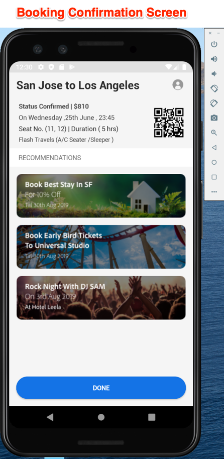

# Download en werk de voorbeeldtoepassing Web.Travel bij

De voorbeeldtoepassing We.Travel wordt vooraf geïmplementeerd met de Adobe Mobile Services SDK v4. U moet het enkel bijwerken, zodat het aan uw eigen Experience Cloud Org en oplossingsrekeningen richt.

## Leerdoelen

Aan het eind van deze les, zult u kunnen:

* Download en open de voorbeeldapp We.Travel in Android Studio
* Verifieer en werk de Montages van SDK van de Mobiele Diensten voor [!DNL Target] bij

## Download de Web.Travel-app

* Download [sample-app-android-SDKv4-Base-Version.zip](assets/sample-app-android-SDKv4-Base-Version.zip)
* Het ZIP-bestand decomprimeren
* Open de toepassing in Android Studio als een bestaand project (negeer eventuele fouten over &quot;Ongeldige VCS-hoofdtoewijzing&quot;).
* Voer de app in een emulator uit om te bevestigen dat de app is gemaakt en dat u het beginscherm kunt zien
* Blader naar de app en controleer of u het boekingsproces kunt voltooien (selecteer een betalingsoptie en druk op Doorgaan om het factureringsscherm over te slaan!)

   

## Verifieer en werk de Montages van SDK van de Mobiele Diensten voor [!DNL Target] bij

De SDK van Adobe Mobile Services is vooraf geïnstalleerd in de Web.Travel-app [volgens de documentatie](https://experienceleague.adobe.com/docs/mobile-services/android/getting-started-android/requirements.html?lang=en). Nu gaat u de installatie bijwerken zodat deze naar uw eigen [!DNL Target]-account verwijst.

Maak eerst een nieuwe toepassing in de gebruikersinterface voor mobiele services:

1. Meld u aan bij de [Adobe Mobile Services-interface](https://mobilemarketing.adobe.com/).
1. Ga naar [!UICONTROL Manage Apps], dan klik **[!UICONTROL Add]** om een nieuwe app toe te voegen om met deze zelfstudie (**[!UICONTROL Manage Apps]** > **[!UICONTROL Add]**) te gebruiken.
1. Kies een Analytics-rapportsuite met niet-productiegegevens, geef de app een naam, selecteer het type **[!UICONTROL Standard]** en klik op **[!UICONTROL Save]**.
1. Nadat de app is toegevoegd, voegt u uw [!DNL Target]-clientcode toe aan het volgende scherm in de sectie [!UICONTROL SDK Target Options] (u vindt uw clientcode in de interface [!DNL Target] onder **[!UICONTROL Setup]** > **[!UICONTROL Implementation]** > **[!UICONTROL Edit Settings]**, naast de knop `at.js` downloaden).
1. De instelling [!UICONTROL Request Timeout] bepaalt hoe lang de toepassing wacht op de reactie van de [!DNL Target]-server voordat de time-outinstructies worden uitgevoerd. Laat de standaardinstelling ongewijzigd.
1. Schakel [!UICONTROL Visitor ID Service] in en zorg dat uw [!UICONTROL Organization] is geselecteerd in de vervolgkeuzelijst.
1. Sla uw wijzigingen op door te klikken op **[!UICONTROL Save]** rechtsboven in het venster (niet op de optie [!UICONTROL Universal Links], [!UICONTROL App Links] of [!UICONTROL Push Services]).
1. Blader naar het gedeelte Downloads App SDK onder aan de pagina en download het configuratiebestand:

   

1. Vervang het `ADBMobileConfig.json`-bestand in de map met Android Studio-projectmiddelen (app > src > main > assets).

1. Open nu het `ADBMobileConfig.json` dossier en zorg ervoor het de verwachte veranderingen zoals uw [!DNL Target] Code van de Cliënt en uw details van Analytics bevat:
   

Als u uw montages niet ziet, bevestig dat u het juiste **[!UICONTROL Save]** knoop in [!UICONTROL Mobile Services] interface klikte en het dossier aan de correcte plaats kopieerde.

Gefeliciteerd! U hebt de SDK bijgewerkt met uw [!DNL Target] accountgegevens! Wij zullen extra bevestiging van de configuratie doen nadat wij [!DNL Target] verzoeken in de volgende les toevoegen.

**[VOLGENDE: &quot;Doelverzoeken toevoegen&quot; >](add-requests.md)**
