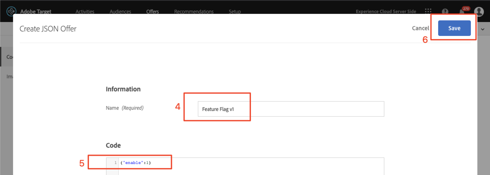

# Functiemarkering

Eigenaars van producten voor mobiele apps hebben de flexibiliteit nodig om nieuwe functies in hun app te implementeren zonder te hoeven investeren in meerdere app-releases. Om de doeltreffendheid te testen, kunnen zij ook de eigenschappen geleidelijk willen uitrollen tot een percentage van de gebruikersbasis. Adobe Target kan worden gebruikt om te experimenteren met UX-functies, zoals kleur, kopiëren, knoppen, tekst en afbeeldingen, en om deze functies aan specifieke doelgroepen te bieden.

In deze les maken we een &quot;feature flag&quot;-aanbieding die kan worden gebruikt als trigger om specifieke toepassingsfuncties in te schakelen.

## Leerdoelen

Aan het eind van deze les, zult u kunnen:

* Een nieuwe locatie toevoegen aan de aanvraag voor de batchprefetch
* Maak een [!DNL Target] activiteit met een aanbieding die als eigenschapmarkering zal worden gebruikt
* De functiemarkering in uw app laden en valideren

## Een nieuwe locatie toevoegen aan de Prefetch-aanvraag aan de thuisactiviteit

In de demo-app uit onze vorige lessen voegen we een nieuwe locatie met de naam &quot;wetravel_feature_flag_recs&quot; toe aan het prefetch-verzoek in de Home Activity en laden we deze met een nieuwe Java-methode naar het scherm.

>[!NOTE] Één van de voordelen van het gebruiken van een prefetch verzoek is dat het toevoegen van een nieuw verzoek geen extra netwerkoverheadkosten toevoegt of extra ladingswerk veroorzaakt aangezien het verzoek binnen het prefetch verzoek wordt verpakt

Controleer eerst of de constante wetravel_feature_flag_recs is toegevoegd aan het bestand Constant.java:


Hier volgt de code:

```java
public static final String wetravel_feature_flag_recs = "wetravel_feature_flag_recs";
```

Voeg nu de locatie toe aan de prefetch-aanvraag en laad een nieuwe functie met de naam `processFeatureFlags()`:


Hier volgt de volledige bijgewerkte code:

```java
public void targetPrefetchContent() {
    List<TargetPrefetchObject> prefetchList = new ArrayList<>();

    Map<String, Object> params1;
    params1 = new HashMap<String, Object>();
    params1.put("at_property", "7962ac68-17db-1579-408f-9556feccb477");

    prefetchList.add(Target.createTargetPrefetchObject(Constant.wetravel_engage_home, params1));
    prefetchList.add(Target.createTargetPrefetchObject(Constant.wetravel_engage_search, params1));
    prefetchList.add(Target.createTargetPrefetchObject(Constant.wetravel_feature_flag_recs, params1));

    Target.TargetCallback<Boolean> prefetchStatusCallback = new Target.TargetCallback<Boolean>() {
        @Override
        public void call(final Boolean status) {
            HomeActivity.this.runOnUiThread(new Runnable() {
                @Override
                public void run() {
                    String cachingStatus = status ? "YES" : "NO";
                    System.out.println("Received Response from prefetch : " + cachingStatus);
                    engageMessage();
                    processFeatureFlags();
                    setUp();

                }
            });
        }};
    Target.prefetchContent(prefetchList, null, prefetchStatusCallback);
}

public void processFeatureFlags() {
    Target.loadRequest(Constant.wetravel_feature_flag_recs, "", null, null, null,
            new Target.TargetCallback<String>(){
                @Override
                public void call(final String s) {
                    runOnUiThread(new Runnable() {
                        @Override
                        public void run() {
                            System.out.println("Feature Flags : " + s);
                            if(s != null && !s.isEmpty()) {
                                //enable or disable features
                            }
                        }
                    });
                }
            });
}
```

### Valideer de aanvraag voor een kenmerkmarkering

Zodra de code wordt toegevoegd, stel de Mededinger op de Activiteit van het Huis in werking en bekijk Logcat voor de bijgewerkte reactie:


## Een JSON-aanbieding met functiemarkering maken

We gaan nu een eenvoudige JSON-aanbieding maken die fungeert als vlag of trigger voor een specifiek publiek, het publiek dat de functie-uitrol in zijn app zou ontvangen. In de [!DNL Target] interface, creeer een nieuwe aanbieding:


Noem het &quot;Vlag van de Eigenschap v1&quot;met de waarde {&quot;toelaat&quot;:1



## Een activiteit maken

Laten we nu een A/B-testactiviteit maken met die aanbieding. Zie de vorige les voor gedetailleerde stappen voor het maken van een activiteit. De activiteit zal slechts één publiek voor dit voorbeeld nodig hebben. In een levend scenario, kunt u specifieke douanepubliek voor specifieke eigenschaproll-outs willen opbouwen, dan de activiteit plaatsen om dat publiek te gebruiken. In dit voorbeeld wijzen we alleen verkeer 50/50 toe (50% voor bezoekers die de functie-updates zouden zien en 50% voor bezoekers die een standaardervaring zouden zien). Hier is de configuratie voor de activiteit:

1. Geef de activiteit de naam &quot;Feature Flag&quot;
1. Selecteer de locatie &quot;wetravel_feature_flag_recs&quot;
1. Wijzig de inhoud in de JSON-aanbieding met de &quot;Feature Flag v1&quot;

   

1. Klik **[!UICONTROL Add Experience]** om ervaring B toe te voegen.
1. De locatie &quot;wetravel_feature_flag_recs&quot; behouden
1. Laat **[!UICONTROL Default Content]** de inhoud staan
1. Klik **[!UICONTROL Next]** om naar het [!UICONTROL Targeting] scherm te gaan

   

1. Controleer op het [!UICONTROL Targeting] scherm of de [!UICONTROL Traffic Allocation] methode is ingesteld op de standaardinstelling (Handmatig) en of elke ervaring de standaardtoewijzing van 50% heeft. Selecteer **[!UICONTROL Next]** om door te gaan naar **[!UICONTROL Goals & Settings]**.

   

1. Stel de **[!UICONTROL Primary Goal]** optie in op **[!UICONTROL Conversion]**.
1. Stel de handeling in op **[!UICONTROL Viewed an Mbox]**. We gebruiken de locatie &quot;wetravel_context_dest&quot; (aangezien deze locatie zich op het bevestigingsscherm bevindt, kunnen we deze gebruiken om te zien of de nieuwe functie tot meer conversies leidt).
1. Klik op **[!UICONTROL Save & Close]**.

   

Activeer de activiteit.

## Valideer de activiteit van de vlaggen van de Eigenschap

Gebruik nu de emulator om te controleren op de aanvraag. Aangezien wij het richten aan 50% van gebruikers plaatsen, zal er een 50% zijn u zult zien de reactie van de eigenschapvlag de `{enable:1}` waarde bevat.


Als je de `{enable:1}` waarde niet ziet, betekent dat dat je niet was aangewezen voor de ervaring. Als tijdelijke test kunt u het voorstel afdwingen om te tonen:

1. Deactiveer de activiteit.
1. Verander de verkeerstoewijzing in 100% op de nieuwe eigenschapervaring.
1. Opslaan en opnieuw activeren.
1. Veeg de gegevens over de emulator en start de app opnieuw.
1. De aanbieding moet nu de `{enable:1}` waarde retourneren.

In een live scenario kan de `{enable:1}` reactie worden gebruikt om meer aangepaste logica in uw app in te schakelen voor het weergeven van de specifieke functieset die u voor het doelpubliek wilt weergeven.

## Conclusie

Mooi werk! U hebt nu de vaardigheden nodig om eigenschappen aan specifiek gebruikerspubliek uit te voeren.
