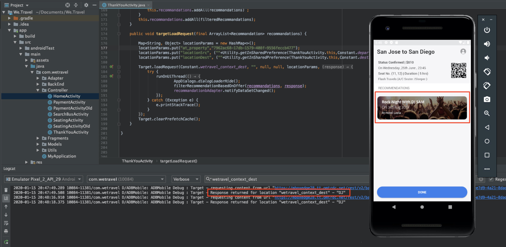

# Lay-outs aanpassen

Nu is het tijd om alles samen te brengen en de gepersonaliseerde ervaringen te creëren. Een _Activiteit_ is het [!DNL Target] mechanisme dat de plaatsen, het publiek, en aanbiedingen samen verbindt, zodat wanneer het verzoek van app wordt gemaakt, met de gepersonaliseerde inhoud [!DNL Target] antwoordt. Wij bouwen twee verpersoonlijkingsactiviteiten in [!DNL Target] en bevestigen dat de gepersonaliseerde inhoud aan de juiste gebruiker op het juiste ogenblik en in de juiste plaats wordt getoond.

## Leerdoelen

Aan het eind van deze les, zult u kunnen:

* Activiteiten bouwen in Adobe Target
* De activiteiten in de voorbeeldtoepassing valideren

## Activiteiten maken in Adobe Target

Leer hoe u engagegebruikers en contextafhankelijke aanbiedingen kunt maken.

### Eerste activiteit - &quot;Gebruikers inschakelen&quot;

Hier volgt een overzicht van de activiteiten die we gaan ontwikkelen:

| Publiek | Locaties | Aanbiedingen |
|---|---|---|
| Nieuwe mobiele App-gebruikers | wetravel_enter_home, wetravel_enter_search | Home: Nieuwe gebruikers inschakelen, zoeken: Nieuwe gebruikers inschakelen |
| Mobiele App-gebruikers retourneren | wetravel_enter_home, wetravel_enter_search | Home: Terugkerende Gebruikers, default_content |

Ga als volgt te werk in de [!DNL Target] interface:

1. Selecteer **[!UICONTROL Activities]** > **[!UICONTROL Create Activity]** > **[!UICONTROL Experience Targeting]**.

   

1. Klik op **[!UICONTROL Mobile App]**.
1. Selecteer de **[!UICONTROL Form composer]**.
1. Selecteer uw werkruimte (dezelfde werkruimte die u ook hebt gebruikt in vorige lessen).
1. Selecteer uw bezit (het zelfde bezit u in vorige lessen gebruikte).
1. Klik op **[!UICONTROL Next]**.

   

1. Wijzig de titel van de activiteit in **[!UICONTROL Engage Users]**.
1. Selecteer de optie **[!UICONTROL ellipsis]** > **[!UICONTROL Change Audience]**.
   
1. Stel het publiek in op **[!UICONTROL New Mobile App Users]**.
1. Klik op **[!UICONTROL Done]**.
   

1. Wijzig de locatie in _wetravel_commit_home_.
1. Selecteer de vervolgkeuzepijl naast Standaardinhoud en selecteer **[!UICONTROL Change HTML Offer]**.

   

1. Selecteer het **[!UICONTROL Home: Engage New Users]** voorstel.
1. Selecteer **[!UICONTROL Done]**.

   

1. Selecteer **[!UICONTROL Add Location]**.
   

1. Selecteer de locatie van _wetravel_engame_search_ .
1. Wijzig de HTML-aanbieding.

   

1. Selecteer het **[!UICONTROL Search: Engage New Users]** voorstel.
1. Klik op **[!UICONTROL Done]**.

   

U hebt zojuist een publiek verbonden met locaties en aanbiedingen en zo de persoonlijke ervaring voor de nieuwe mobiele App-gebruikers gecreëerd! De ervaring moet er nu als volgt uitzien:

Maak nu een ervaring voor het retourneren van gebruikers van mobiele apps:

1. Selecteer **[!UICONTROL Add Experience Targeting]** links.
1. Selecteer het publiek **[!UICONTROL Returning Mobile App Users]**.
1. Selecteer **[!UICONTROL Done]**.
   

Gebruik nu het zelfde proces wij vroeger gebruikten om de nieuwe ervaring te vormen. De configuratie voor de beleving van de Mobiele App van de Gebruikers die terugkeren zou als volgt moeten kijken:

Laten we doorgaan naar het volgende scherm in de configuratie:

1. Klik **[!UICONTROL Next]** om naar het **[!UICONTROL Targeting]** scherm te gaan.
1. Gebruik de standaardinstellingen voor Doel. Als u ervaring had met publiek dat overlapte (bijvoorbeeld _New York Users_ en _First Time Users_), kon u de prioritaire orde op dit scherm schikken.
1. Klik **[!UICONTROL Next]** om door te gaan naar **[!UICONTROL Goals & Settings]**.

   

Laten we nu de activiteiteninstellingen voltooien:

1. Stel de **[!UICONTROL Primary Goal]** optie in op **[!UICONTROL Conversion]**.
1. Stel de handeling in op **[!UICONTROL Viewed an mbox]** > _wetravel_context_dest_ (Aangezien deze locatie zich op het bevestigingsscherm bevindt, kunnen we deze gebruiken om conversies te meten).

   

1. Houd alle andere montages op het scherm aan de gebreken.
1. Klik **[!UICONTROL Save & Close]** om de activiteit op te slaan.
1. Activeer het **[!UICONTROL Activity]** op het volgende scherm.

Onze eerste activiteit is nu live en klaar om te testen!

### Tweede activiteit - &quot;Contextuele aanbiedingen&quot;

Hier volgt een overzicht van de tweede activiteit die we gaan ontwikkelen:

| Publiek | Locatie | Aanbiedingen |
| --- | --- | --- |
| Doel: San Diego | wetravel_context_dest | Bevordering van San Diego |
| Doel: Los Angeles | wetravel_context_dest | Promotie voor Los Angeles |

Herhaal hetzelfde proces als hierboven voor de volgende activiteit - &quot;Contextuele aanbiedingen&quot;. De definitieve configuratie voor beide ervaringen wordt hieronder getoond:

#### San Diego

#### Los Angeles

Bij de stap Doelstellingen en instellingen wijzigen we het primaire doel in de locatie op het bevestigingsscherm van de reservering:

1. Stel onder de **[!UICONTROL Reporting Settings]** optie de waarde in **[!UICONTROL Primary Goal]** op **[!UICONTROL Conversion]**.
1. Stel de handeling in op **[!UICONTROL Viewed an mbox]** > _wetravel_context_dest_ (in deze activiteit is deze metrische waarde in feite betekenisloos omdat dit ook dezelfde locatie is die de ervaring oplevert).
1. Klik op **[!UICONTROL Save & Close]**.

Activeer de Activiteit op het volgende scherm.

Onze tweede activiteit is live en klaar om te testen!

## Het thuisvoorstel valideren

Voer de emulator uit en controleer of de eerste aanbieding onder aan het thuisscherm wordt weergegeven. Als u een terugkerende gebruiker bent met 5 of meer toepassingslanceringen, zou u de _welkomstaanbieding_ getoond zien. Als u een nieuwe gebruiker bent (minder dan 5 toepassingen worden gestart), ziet u het _nieuwe gebruikersbericht_ :

Als de nieuwe gebruikersaanbieding niet wordt weergegeven, probeert u de gegevens voor uw emulator te wissen. De volgende keer dat u de app start, wordt de app opnieuw ingesteld op 1. Dit gebeurt onder **[!UICONTROL Tools]** > **[!UICONTROL AVD Manager]**. Mogelijk moet u Android Studio opnieuw starten als Logcat niet correct werkt:

U kunt de reactie in Logcat ook bevestigen door voor _wetravel_engt_home_ te filtreren:

## Zoekvoorstel valideren

Selecteer **[!UICONTROL San Jose]** als uw **[!UICONTROL Departure]** en **[!UICONTROL San Diego]** als uw **[!UICONTROL Destination]** en klik **[!UICONTROL Find Bus]** om naar beschikbare bussen te zoeken.

Op het resultatenscherm, zou u het bericht van de _gebruiksfilters_ moeten zien. Als u een terugkerende gebruiker bent met 5 of meer toepassingslanceringen, zal geen bericht hier verschijnen aangezien de standaardinhoud voor deze plaats (die leeg is) wordt geplaatst:

## Valideer de contextafhankelijke aanbiedingen op het scherm Bedankt

Doorgaan met het boekingsproces:

* Selecteer een bus op het resultatenscherm.
* Selecteer een licentie op het uitcheckscherm.
* Selecteer **[!UICONTROL Credit Card]** op het betalingsscherm (laat de betalingsinformatie leeg - er vindt geen eigenlijke boeking plaats).

Aangezien San Diego als bestemming werd geselecteerd, zou u de _DJ SAM_ aanbiedingsbanner op het bevestigingsscherm moeten zien:

Selecteer nu **[!UICONTROL Done]** en probeer een andere boeking met Los Angeles als bestemming. In het bevestigingsscherm moet de banner _Universal Studios_ worden weergegeven:

## Conclusie

Gefeliciteerd! Hiermee wordt het hoofdgedeelte van de zelfstudie voor Adobe Target SDK 4.x voor Android voltooid. U hebt nu de vaardigheden om personalisatie te implementeren in Android-apps! U kunt deze documentatie en de demo-app gebruiken als referentie voor uw toekomstige projecten.

Volgende: Functiemarkering is een andere functie die kan worden geïmplementeerd met Adobe Target in Android. Als u meer wilt weten over het markeren van functies, checkt u de volgende les uit.

**[VOLGENDE: Functiemarkering >](feature-flagging.md)**
