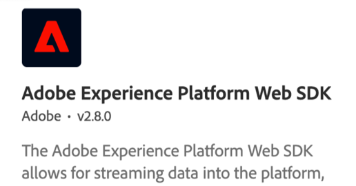

# Adobe Target-zelfstudies

[!DNL Adobe Target] is de [!DNL Adobe Experience Cloud] oplossing die alles biedt wat u nodig hebt om de ervaring van uw klanten op maat te maken en aan te passen. [!DNL Target] helpt u uw omzet te maximaliseren op uw web en mobiele sites, apps, sociale media en andere digitale kanalen. Gebruik deze video&#39;s en zelfstudies om de vele componenten van [!DNL Adobe Target].

>[!NOTE]
>
>Naast deze handleiding wordt het volgende [!DNL Adobe Target] hulplijnen zijn ook beschikbaar :
>
>* *[Handleiding Adobe Target Business Practitioner](https://experienceleague.adobe.com/docs/target/using/target-home.html){target=_blank}*
>
>* *[Adobe Target Developer Guide](https://experienceleague.adobe.com/docs/target-dev/developer/overview.html){target=_blank}*

## Personeelsselectie

<table style="margin-top: 0 !important">
<tr>
  <td>
    
    

      <a href="https://experienceleague.adobe.com/docs/platform-learn/migrate-target-to-websdk/introduction.html">
    <strong>Doel migreren van at.js naar Web SDK van Platform</strong>
    </a>
    

    

    <em>Leer hoe u uw at.js-implementatie kunt migreren naar Adobe Experience Platform Web SDK.</em>
    

  </td>
  <td>
    
    

      <a href="https://experienceleague.adobe.com/docs/platform-learn/implement-in-websites/implement-solutions/target.html">
    <strong>Doel implementeren met Adobe Experience Platform-tags</strong>
    </a>
    

    

    <em>Leer hoe u de Adobe Target-extensie implementeert met een aanvraag voor het laden van een pagina en aangepaste parameters.</em>
    

  </td>
   <td>
    
    

    <a href="https://experienceleague.adobe.com/docs/target-learn/tutorials/implementation/implement-atjs-20-in-a-single-page-application.html">
    <strong>Implementeren om 0,00 in een SPA</strong>
    </a>
    

    

    <em> Leer hoe u Adobe Target op 2.js 2.0 (en hoger) in toepassingen voor één pagina (SPA).</em>
    

  </td>
</tr>
</table>