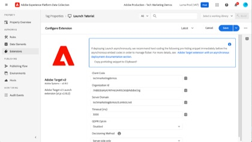

# Adobe Target-zelfstudies

[!DNL Adobe Target] is de [!DNL Adobe Experience Cloud] -oplossing die alles biedt wat u nodig hebt om de ervaring van uw klanten op maat te maken en aan te passen. Met [!DNL Target] kunt u uw omzet maximaliseren op uw websites en mobiele sites, apps, sociale media en andere digitale kanalen. Gebruik deze video&#39;s en zelfstudies om de vele componenten van [!DNL Adobe Target] te leren.

>[!NOTE]
>
>Naast deze handleiding zijn ook de volgende [!DNL Adobe Target] hulplijnen beschikbaar:
>
>* [&#128279;](https://experienceleague.adobe.com/docs/target/using/target-home.html?lang=nl-NL){target=_blank} *van de Bedrijfs Adobe Target Gids van de Praktijk*
>
>* *[de Gids van de Ontwikkelaar van Adobe Target ](https://experienceleague.adobe.com/docs/target-dev/developer/overview.html?lang=nl-NL){target=_blank}*

## Personeelsselectie

<table style="margin-top: 0 !important">
<tr>
  <td>
    
    

      <a href="https://experienceleague.adobe.com/docs/platform-learn/migrate-target-to-websdk/introduction.html?lang=nl-NL">
    <strong> Migreer Doel van at.js aan het Web SDK van het Platform </strong>
    </a>
    

    

    <em> Leer hoe te om uw implementatie at.js aan het Web SDK van Adobe Experience Platform te migreren.</em>
    

  </td>
  <td>
    
    

      <a href="https://experienceleague.adobe.com/docs/platform-learn/implement-in-websites/implement-solutions/target.html?lang=nl-NL">
    <strong> voer Doel met de Markeringen van Adobe Experience Platform uit </strong>
    </a>
    

    

    <em> leer hoe te om de uitbreiding van Adobe Target met een verzoek van de paginading en douaneparameters uit te voeren.</em>
    

  </td>
   <td>
    
    

    <a href="https://experienceleague.adobe.com/docs/target-learn/tutorials/implementation/implement-atjs-20-in-a-single-page-application.html?lang=nl-NL">
    <strong> voer bij.js 2.0 in een SPA uit </strong>
    </a>
    

    

    <em> Leer hoe u Adobe Target-toepassingen in.js 2.0 (en hoger) implementeert in toepassingen voor één pagina (SPA). </em>
    

  </td>
</tr>
</table>