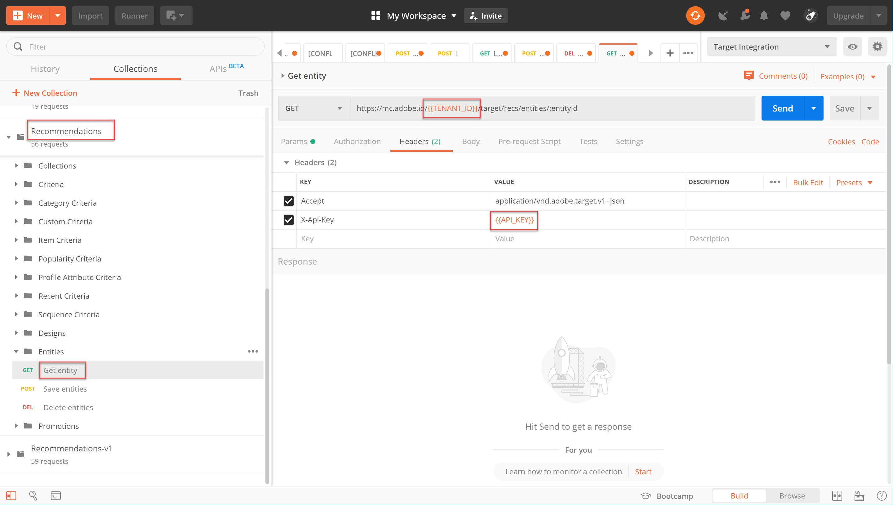

# Uw [!DNL Recommendations] catalogus beheren met API&#39;s

Op dit punt hebt u geleerd hoe u een toegangstoken kunt genereren met behulp van de JWT-verificatiestroom en zo de Adobe Target Admin API&#39;s met Adobe I/O kunt gebruiken.

U kunt de API&#39;s [van](https://developers.adobetarget.com/api/recommendations/) Recommendations gebruiken om items toe te voegen, bij te werken of te verwijderen uit uw catalogus met aanbevelingen. Net als bij de andere API&#39;s van Adobe Target Admin is verificatie vereist voor de API&#39; [!DNL Recommendations] s.

>[!TIP]
>
>Verzend het **[!UICONTROL IMS: JWT Generate + Auth via User Token]** verzoek wanneer u uw toegangstoken voor authentificatie moet verfrissen, aangezien het na 24 uren verloopt. Zie Adobe API-verificatie [](../apis/configure-io-target-integration.md) configureren voor instructies.


>[!NOTE]
>
>Haal de verzameling [van](https://developers.adobetarget.com/api/recommendations/#section/Postman)Recommendations Postman op voordat u verdergaat.

## Items maken en bijwerken met de API Entiteiten opslaan

Als u de [!DNL Recommendations] productdatabase wilt vullen met de API in plaats van met een CSV-productfeed of als u [!DNL Target] een aanvraag wilt indienen om op de productpagina&#39;s te starten, gebruikt u de API [Entiteiten](https://developers.adobetarget.com/api/recommendations/#operation/saveEntities)opslaan. Met deze aanvraag wordt een item in één [!DNL Target] omgeving toegevoegd of bijgewerkt. De syntaxis is:

```
POST https://mc.adobe.io/{{TENANT_ID}}/target/recs/entities
```

Bijvoorbeeld, sparen Entiteiten kunnen worden gebruikt om punten bij te werken wanneer bepaalde drempels worden voldaan-zoals drempels voor inventaris of prijs-om die punten te markeren en hen te verhinderen worden geadviseerd.

1. Navigeer naar **[!DNL Target]>[!UICONTROL Setup]>[!UICONTROL Hosts]>[!UICONTROL Environments]** om de [!DNL Target] Omgeving-id te verkrijgen waarin u een item wilt toevoegen of bijwerken.

   

2. Verifieer `TENANT_ID` en `API_KEY` verwijs de Postman milieuvariabelen die eerder worden gevestigd. Gebruik de onderstaande afbeelding om deze te vergelijken. Wijzig zo nodig de koppen en het pad in de API-aanvraag, zodat deze overeenkomen met de waarden in de onderstaande afbeelding.

   

3. Voer uw JSON-code als **onbewerkte** code in het **body**. Vergeet niet uw milieu-id te specificeren, gebruikend de `environment` variabele. (In het onderstaande voorbeeld is de milieu-id 6781.)

   

   >!![NOTE]
   Hieronder ziet u een voorbeeld van JSON waarmee entiteit.id kit2001 wordt toegevoegd aan de bijbehorende entiteitswaarden voor een product van Toaster Oven, in omgeving 6781.

   ```
      {
      "entities": [{
              "name": "Toaster Oven",
              "id": "kit2001",
              "environment": 6781,
              "categories": [
                  "housewares:appliances"
              ],
              "attributes": {
                  "inventory": 77,
                  "margin": 23,
                  "message": "crashing helicopter",
                  "pageUrl": "www.foobar.foo.com/helicopter.html",
                  "thumbnailUrl": "www.foobar.foo.com/helicopter.jpg",
                  "value": 19.2
              }
          }]
      }
   ```

4. Klik op **Verzenden**. U dient het volgende antwoord te ontvangen.

   

Het JSON-object kan worden geschaald om meerdere producten te verzenden. In deze JSON worden bijvoorbeeld twee entiteiten opgegeven.

```
    {
        "entities": [{
                "name": "Toaster Oven",
                "id": "kit2001",
                "environment": 6781,
                "categories": [
                    "housewares:appliances"
                ],
                "attributes": {
                    "inventory": 89,
                    "margin": 11,
                    "message": "Toaster Oven",
                    "pageUrl": "www.foobar.foo.com/helicopter.html",
                    "thumbnailUrl": "www.foobar.foo.com/helicopter.jpg",
                    "value": 102.5
                }
            },
            {
                "name": "Blender",
                "id": "kit2002",
                "environment": 6781,
                "categories": [
                    "housewares:appliances"
                ],
                "attributes": {
                    "inventory": 36,
                    "margin": 5,
                    "message": "Blender",
                    "pageUrl": "www.foobar.foo.com/helicopter.html",
                    "thumbnailUrl": "www.foobar.foo.com/helicopter.jpg",
                    "value": 54.5
                }
            }
        ]
    }
```

1. Nu is het jouw beurt! Gebruik de API **Entiteiten** opslaan om de volgende items aan uw catalogus toe te voegen. Gebruik het JSON-voorbeeld hierboven als beginpunt. (U moet de JSON uitbreiden tot extra entiteiten.)

   

Die laatste twee items horen niet thuis. Controleer ze met behulp van de **Get Entiteit** API en verwijder ze indien nodig met de **Delete Entities** API.

## Itemdetails ophalen met de Get Entiteit API

Als u de details van een bestaand item wilt ophalen, gebruikt u de API [voor](https://developers.adobetarget.com/api/recommendations/#operation/getEntity)Entiteit ophalen. De syntaxis is:

```
GET https://mc.adobe.io/{{TENANT_ID}}/target/recs/entities/[entity.id]
```

De gegevens van de entiteit kunnen slechts voor één enkele entiteit tegelijkertijd worden teruggewonnen. Met Entiteit ophalen kunt u controleren of er updates zijn gemaakt in de catalogus zoals u had verwacht, of kunt u de inhoud van de catalogus op een andere manier controleren.

1. Geef in de API-aanvraag de id van de entiteit op met behulp van de variabele `entityId`. In het volgende voorbeeld worden gegevens geretourneerd voor de entiteit waarvan de entiteitId=kit2004.

   

2. Verifieer `TENANT_ID` en `API_KEY` verwijs de Postman milieuvariabelen die eerder worden gevestigd. Gebruik de onderstaande afbeelding om deze te vergelijken. Wijzig zo nodig de koppen en het pad in de API-aanvraag, zodat deze overeenkomen met de waarden in de onderstaande afbeelding.

   

3. Verzend de aanvraag.

   Als u een fout ontvangt die verklaart de entiteit niet werd gevonden, zoals aangetoond in het voorbeeld hierboven, verifieert u het verzoek aan het correcte [!DNL Target] milieu voorlegt.

   >[!NOTE]
   Als geen milieu uitdrukkelijk wordt gespecificeerd, krijg de pogingen van de Entiteit om de entiteit van uw [standaardmilieu](https://docs.adobe.com/content/help/en/target/using/administer/hosts.html#section_4F8539B07C0C45E886E8525C344D5FB0) slechts te krijgen. Als u van om het even welke milieu buiten uw standaardomgeving wenst te trekken, moet u milieu-identiteitskaart specificeren.

4. Voeg zo nodig de `environmentId` parameter toe en verzend de aanvraag opnieuw.

   

5. Verzend een ander **Get verzoek van de Entiteit** , dit keer om de entiteit te inspecteren waarvan entityId=kit2005.

   

Stel dat u besluit dat deze entiteiten uit de catalogus moeten worden verwijderd. Laten we de **Delete Entities** API gebruiken.

## Items verwijderen met de API Entiteiten verwijderen

Als u items uit uw catalogus wilt verwijderen, gebruikt u de API [Entiteiten](https://developers.adobetarget.com/api/recommendations/#operation/deleteEntities)verwijderen. De syntaxis is:

```
DELETE https://mc.adobe.io/{{TENANT_ID}}/target/recs/entities?ids=[comma-delimited-entity-ids]&environment=[environmentId]
```

>[!WARNING]
Deze API verwijdert entiteiten waarnaar wordt verwezen door id&#39;s die u opgeeft.
Als er geen id&#39;s voor entiteiten zijn opgegeven, worden alle entiteiten in de opgegeven omgeving verwijderd. Als er geen milieu-id is opgegeven, worden entiteiten uit alle omgevingen verwijderd. Wees voorzichtig!

1. Navigeer naar **[!DNL Target]>[!UICONTROL Setup]>[!UICONTROL Hosts]>[!UICONTROL Environments]** om de [!DNL Target] Omgeving-id te verkrijgen waaruit u items wilt verwijderen.

   

2. Geef in de API-aanvraag de entiteit-id&#39;s op van de entiteiten die u wilt verwijderen, met behulp van de syntaxis `&ids=[comma-delimited-entity-ids]` (een queryparameter). Wanneer u meerdere entiteiten verwijdert, scheidt u de id&#39;s met komma&#39;s.

   

3. Geef de milieu-id op met behulp van de syntaxis `&environment=[environmentId]`, anders worden entiteiten in alle omgevingen verwijderd.

   

4. Verifieer `TENANT_ID` en `API_KEY` verwijs de Postman milieuvariabelen die eerder worden gevestigd. Gebruik de onderstaande afbeelding om deze te vergelijken. Wijzig zo nodig de koppen en het pad in de API-aanvraag, zodat deze overeenkomen met de waarden in de onderstaande afbeelding.

   

5. Verzend de aanvraag.

   

6. Verifieer de resultaten met **Entiteit** ophalen. Geef nu aan welke verwijderde entiteiten niet kunnen worden gevonden.

   

   

Gefeliciteerd! U kunt de API&#39; [!DNL Recommendations] s nu gebruiken om gegevens over de entiteiten in uw catalogus te maken, bij te werken, te verwijderen en op te halen. In de volgende sectie leert u hoe u aangepaste criteria kunt beheren.

[Volgende &quot;Aangepaste criteria beheren&quot; >](manage-custom-criteria.md)
